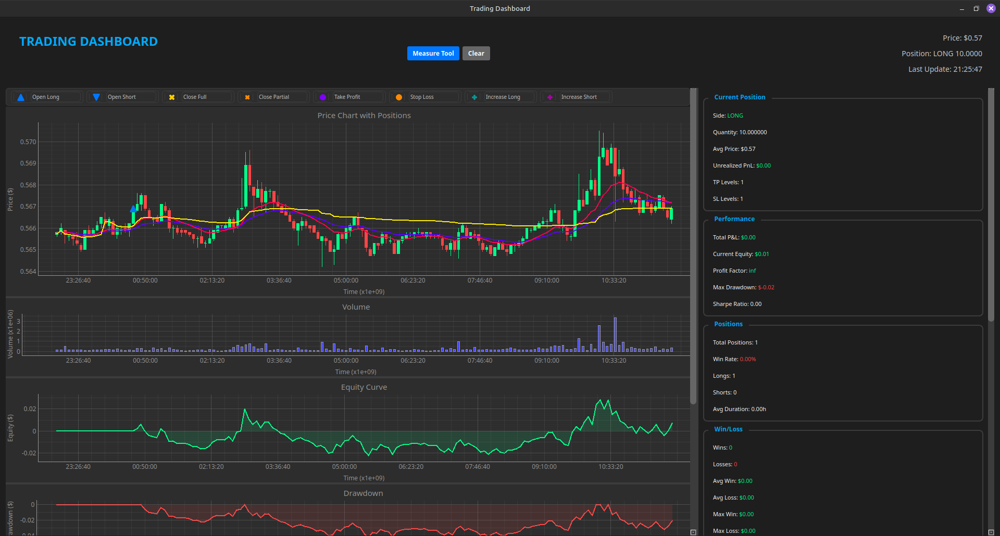
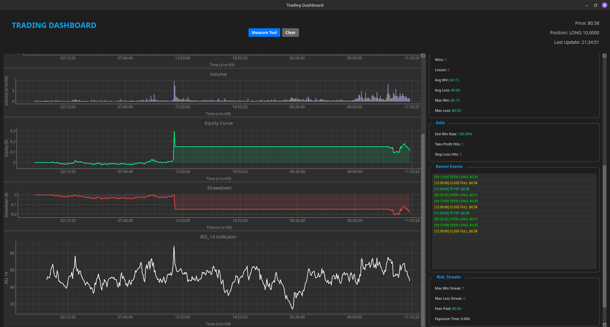
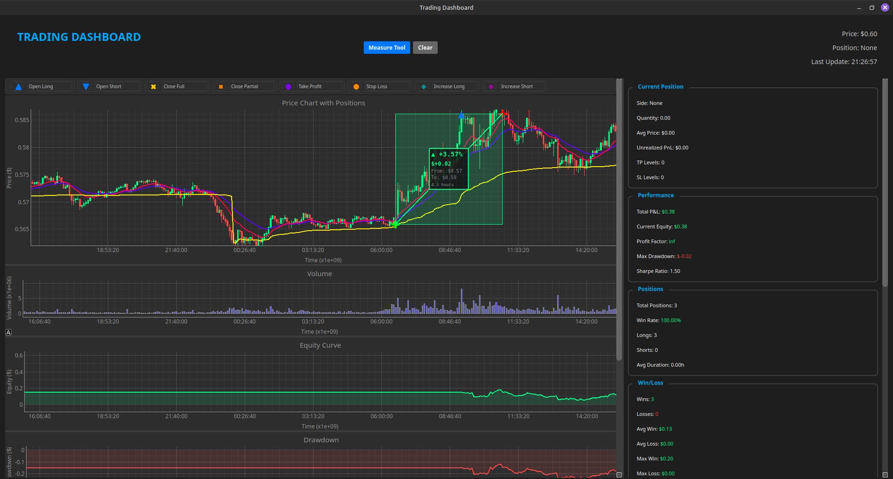
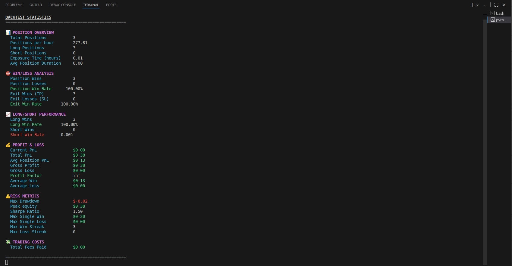

# ⚙️ Algo-Trading Backtesting Framework

A modular and efficient **algorithmic trading backtesting framework** for testing, analyzing, and visualizing trading strategies on **live or historical data**.  
It is built to be **extensible, performant**, and **developer-friendly** — suitable for both backtesting and real trading (via specialized position managers).

---

## 🚀 Features

- 🧩 **Modular Architecture** – Easily extend or override base components such as data providers, position managers, or backtesters.  
- ⚡ **High Performance** – Uses **multiprocessing** and **async I/O** to process data efficiently.  
- 📊 **Live or Historical Backtesting** – Run strategies on live streams or historical datasets.  
- 📈 **Interactive GUI** – Real-time visualization of candles, indicators, and open positions.  
- 💰 **Comprehensive Metrics** – Track PnL, drawdown, Sharpe ratio, win rate, exposure time, and more.  
- 🔧 **Real-Trading Ready** – Extendable for integration with real exchanges or brokers.  

---

## 🏁 Quick Start

### 1️⃣ Install Dependencies
```bash
pip install -r requirements.txt
```

### 2️⃣ Run Example Strategy
```bash
python main.py
```

You can modify or replace `main.py` with your own strategy implementation using the base framework classes.

---

## 🧠 Core Concepts

The framework is organized into modular packages that separate concerns between **data**, **strategy logic**, **position management**, and **visualization**.  
Each layer can be easily extended or replaced to suit your custom trading workflows.

### 📂 `core/`
Core trading logic and building blocks for strategy design and execution.

- **`base_strategy.py`** → Abstract base class for implementing trading strategies (entry/exit logic, signal generation).  
- **`indicator_manager.py`** → Containes logic for adding, updating and getting indicators.  
- **`indicators.py`** → Contains implementations or wrappers for common technical indicators.  
- **`position_manager.py`** → Handles trade lifecycle — opens, closes, and tracks active positions.  
- **`position.py`** → Defines the `Position` data structure (entries, exits, side, PnL, etc.).  

### 📂 `backtesting/`
Responsible for simulating trades, tracking metrics, and visualizing results.

- **`backtester.py`** → Runs the backtest loop, updates stats, computes metrics like Sharpe ratio and drawdown.  
- **`plotter.py`** → Handles chart rendering for candles, indicators, and trade markers.  
- **`tools.py` / `misc.py`** → Contains the tools provided in the GUI.  
- **`candle_item.py`** → Standard representation of OHLC candles used for plotting.  

### 📂 `data/`
Abstracts market data input and streaming.

- **`base_candle.py`** → Defines the unified candle data structure.  
- **`data_provider.py`** → Handles fetching and streaming of live or historical candle data.  

### 🧮 `BaseBacktester` & `BaseBacktestStats`
- **`BaseBacktester`** controls the simulation loop: updates on every candle, applies stop-loss/take-profit logic, and logs equity.  
- **`BaseBacktestStats`** collects performance metrics: PnL, win rate, Sharpe ratio, profit factor, drawdown, position frequency, etc.


### 📊 Visualization
- The GUI displays **live charts** (price, indicators, open trades, PnL) and **real-time statistics**.  
- Uses `plotter.py` and `candle_item.py` to render data interactively.  
- Screenshots of this interface are shown below.

### 🧠 Extensibility
- Implement your own strategy by subclassing `BaseStrategy`.  
- Swap out the `DataProvider` for any exchange API or custom dataset.  
- Modify `PositionManager` to integrate with **live trading systems**.

---

This modular design ensures that you can easily:
- Add new data sources  
- Integrate new indicators  
- Customize position handling  
- Extend the visualization and reporting layer

---

## 🖥️ Screenshots

Left section shows charts, right section shows live stats:  


Separate chart indicators displayed below the main chart:  


Measure tool demo:  


Shell printing of detailed backtest stats:  


---


## 🧩 TODO / Roadmap

- 📝 Write full documentation and code reference  
- 🧹 Refactor and add inline comments  
- 🚀 Further performance optimization  
- 🧰 Add more tools (position sizing, parameter optimization, etc.)  
- 📈 Add advanced visualizations and reporting  

---

## 🤝 Contributing

Pull requests are welcome!  
If you’d like to contribute improvements, bug fixes, or new modules, feel free to fork the repo and open a PR.

---

## 📜 License

This project is released under the **MIT License** — free for personal and commercial use.

---


> Made with ❤️ for traders, quants, and developers who love clean and flexible backtesting tools.